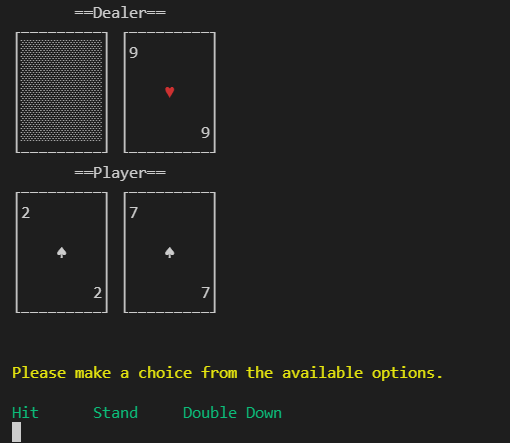

 # 🃏 Blackjack game & Websockets 🃏
 ***
A simple blackjack game for my java II final @ Dawson College

# Installation

You can run the server main method with any host that accepts foreign connections and has a recent version of java.

### LICENCE 
 Feel free to contribute or steal this project all together if you want.
No need to credit me. Who even owns code?
